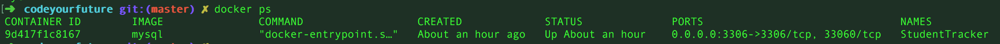

# Steps to set up MySQL db as a docker container

## What you'll need

- MySQL version 5.6 or latest (This will be downloaded from docker hub)
- Docker 16.8x or latest


### How to start:
All containers are downloaded from docker hub `https://hub.docker.com`
First install docker `https://docs.docker.com/docker-for-windows/install/`

Check if you have any containers running.
```sh
$ docker ps
```

Install/download mysql image locally. Set details for your specific container and for MySQL password.
```sh
$ docker run -p 3306:3306 --name StudentTracker -e MYSQL_ROOT_PASSWORD=<Your Password> -d mysql
```

Once installed check if it is running by using the command `docker ps`.


Now let's log in into your container using your container ID.
```sh
$ docker exec -it <Container ID> /bin/bash
```

To exit the container type `exit`

Let's log in our new MySQL installed

```sh
$ docker exec -it StudentTracker mysql -uroot -p
```

You will have something like this displayed in your console:

