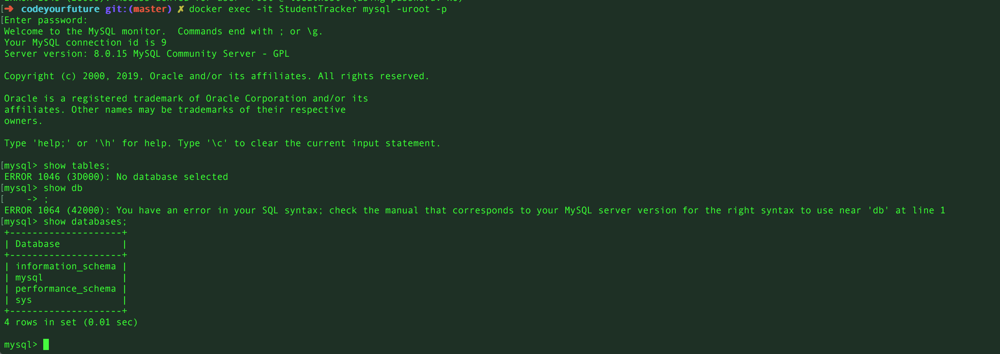

#Steps to set up MySQL db as a docker container

## What you'll need

- MySQL version 5.6 or latest
- Docker 16.8x or latest


### How to start:
All containers are downloaded from docker hub `https://hub.docker.com`

Check if you have any container running.
```sh
$ docker ps
```

Install/download mysql image locally. Set detailsfor your specific container and MySQL password.
```sh
$ docker run -p 3306:3306 --name StudentTracker -e MYSQL_ROOT_PASSWORD=#### -d mysql
```

Once installed check if it is running by using the command `docker ps`.
Log in into your container using your container ID.
```sh
$ docker exec -it 9d417f1c8167 /bin/bash
```

To exit the container type `exit`

Let's log in our new MySQL installed

```sh
$ docker exec -it StudentTracker mysql -uroot -p
```

You will have something like this displayed in your console:

